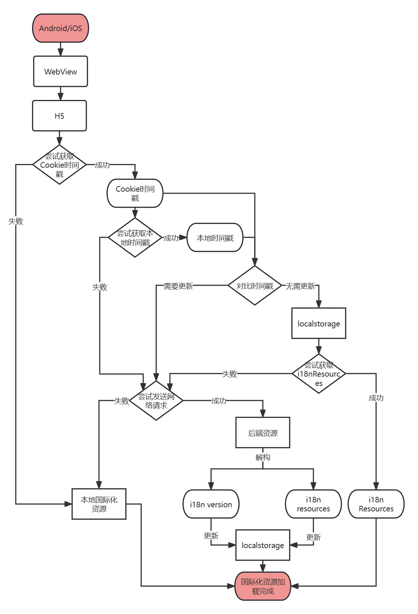

## 背景介绍
本文介绍了一种嵌入到原生客户端（安卓和IOS）中的H5页面中资源热更新的一种策略。

通常使用WebView技术将H5页面嵌入到原生客户端中，作为二级页面，以此来提高开发效率。但由此带来的一个问题就是：如何向H5页面传递信息。

常见的作法有两种：1. 通过在js全局对象上注入方法的方式；2. 原生打开H5页面的时候通过cookie传递消息。

这两种做法各有利弊：
- 注入js方法的方式可以携带较大的数据量，但是缺点在于： 1. 注入需要时间；2. 传递的数据量超过限制之后会导致App闪退；
- 通过cookie的方式克服了注入等待时间的缺点，但是cookie能够携带的数据量比较小，不能作为大量数据传递的途径。

## 解决方案
笔者在工作实践中采用的方式是：**cookie+时间戳**的方式；通过cookie不传递信息，而是传递信息是否更新的时间戳；通过和本地保存的时间戳进行对比，可以判断出本地保存的信息是否过期，如果过期，再由H5向后端请求数据。

下面是国际化资源热更新的流程图，从中清晰的体现出资源热更新的策略：

