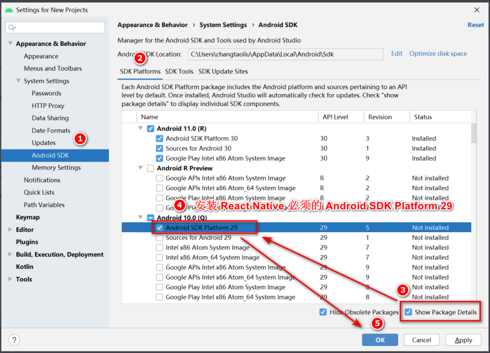
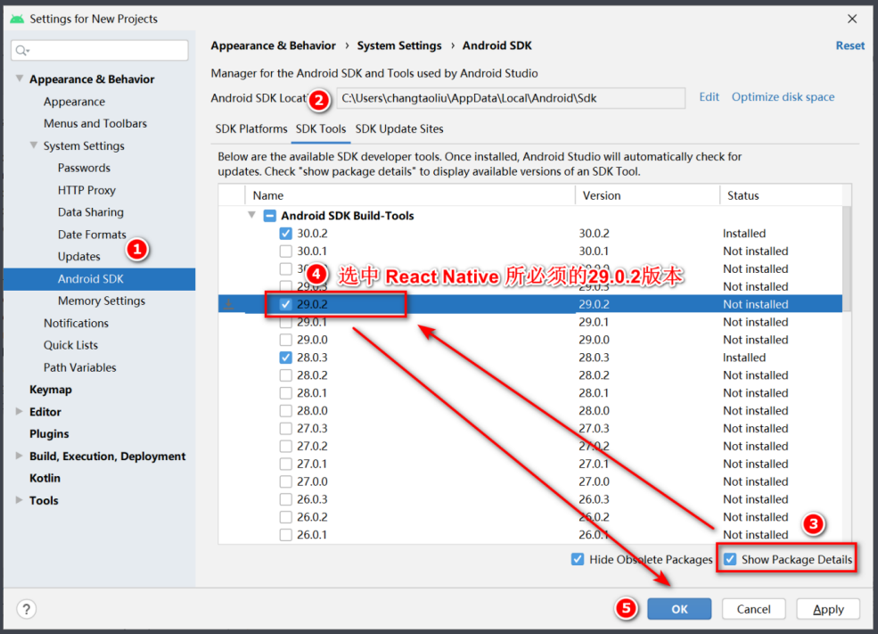
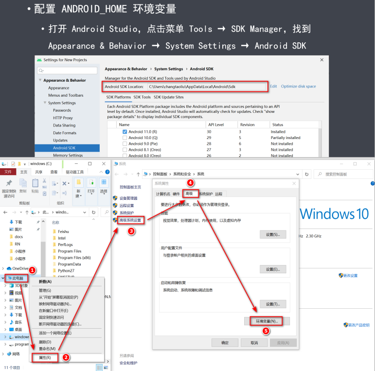
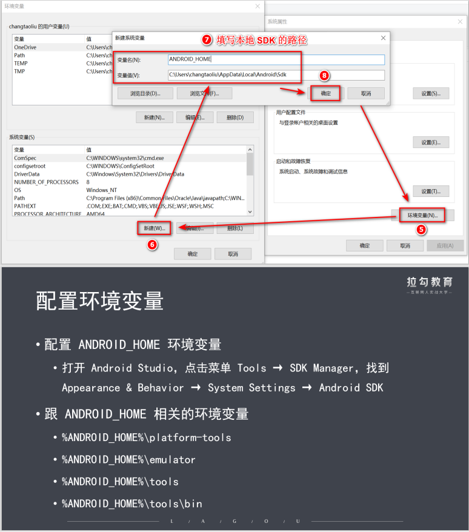
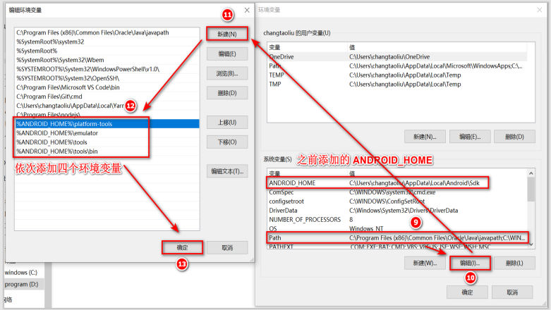

# React Native
## 概述
五大方面内容：
- 简介
- 搭建开发环境
- 基础语法
- 架构原理
- 项目实践

## 1. 简介
FaceBook 2015 IOS Android https://reactnative.dev/

移动App的开发模式：
原生开发->原生App->Android、iOS、Windows（X）
混合开发->混合App->Reactive Native（FaceBook）、Weex（Alibaba）、Flutter（Google）
H5开发->Web App->HTML、CSS、JavaScript
引擎 JSCore、V8、Flutter engine

### RN的优势
- 开发体验好
- 开发成本低
- 学习成本低

### RN和客户端的关系
RN-->Bridge-->Andriod(Kotlin | Java)
       |----->IOS(Swift | Objective-C)

### RN的劣势
- 不成熟
- 性能差
- 兼容性差

### 搭建开发环境概述
- 1. 基础环境
- 2. 搭建安卓环境
- 3. 搭建iOS环境
- 4. 初始化项目

1. 基础环境搭建
安装Node.js->安装Yarn->安装RN脚手架(npm install -g react-native-cli)

!windows下只能搭建Android开发环境；但是Mac下既能搭建Android开发环境，也能搭建iOS开发环境

搭建环境需要科学上网

### 搭建安卓开发环境
- 1. 安装JDK
- 2. 安装Android Studio
- 3. 安装Android SDK
- 4. 配置环境变量

1. 安装SDK：必须是1.8版本的，需要登陆，然后一直下一步即可，使用java -version验证
2. 安装Android Studio：下载、安装、启动Android Studio，然后创建项目

！Android Studio会自动安装最新版本的SDK，但是RN需要特定版本的SDK，这就是为什么需要单独下载SDK的原因了。
在Tools下找到SDK Manager，然后按照下面的顺序进行：






### 初始化项目
1. 创建项目 `react-native init myproject && cd myproject && yarn android`
2. 安装vscode插件 **ES7 React/Redux/GraphQL/React-Native snippets** 使用快捷命令，例如：rnc rnf
3. 调试工具: 模拟器会随着Android Studio和Xcode一起安装，启动应用，模拟器也会一起启动-在模拟器中点击一下，然后按下ctrl+m选择debug开始调试
4. 真机调试：打开USB调试模式-通过USB将电脑和手机连接起来-启动应用，在手机上安装应用

### 推荐的开发环境
- win10
- vs code
- rn@0.63.3
- react@16.13.1

### 基础语法 - style
- 1. 掌握React：JSX 组件 生命周期 Hook API Redux 常用安装包
- 2. Style Sheet
- 3. Flexbox
- 4. 组件和API
- 5. 路由与导航

RN中的样式与CSS中是不同的：没有继承性（只有Text组件有继承性）、样式名采用小驼峰、所有尺寸都没有单位、有些特殊的样式名称在web开发的时候是没有的（marginHorizontal marginVertical）

样式声明的两种方式：对象或者数组对象（如果是数组形式的，后面的可以覆盖前面的）

样式的使用方式：
```js
import { StyleSheet } form 'react-native';
const styles = StyleSheet.create({
    foo: fooStyleObj,
    bar: barStyleObj,
});

// 使用
style = {[styles.foo, styles.bar]}
```

### 基础语法 - FlexBox
- 1. 基本概念：容器、项目、主轴（默认为竖直方向）、交叉轴
- 2. 常见属性：flexDirection、justifyContnent、alignItems、flex
- 3. 获取屏幕尺寸：`import {Dimensions} from 'react-native'; const windowSize = Dimensions.get('window'); const windowWidth = windowSize.width;`

### 基础语法 - 组件和API
- 1. 简介
- 2. 核心组件：本质上是对原生组件的封装，是来自react-native库的组件；例如Image组件实际上是对Android中的ImageView或者iOS中的UIImageView组件的封装；View或者Text组件也是如此。核心组件可以分成以下几类：基础组件、交互控件、列表视图、iOS或者Android独有组件、其他组件。具体来说核心组件有：View Text Alert Button Switch StatusBar ActivityIndicator Image TextInput Touchable ScrollView SectionList FlatList Animated（组件必须经过特殊处理才能够有动画）
- 3. 第三方组件
- 4. 自定义组件


### Image组件
- 作用： 加载图片
- 加载方式：本地路径、网络路径、Base64格式


### Touchable组件
- TouchableHighlight：触碰后高亮显示
- TouchableOpacity：触碰之后透明度降低
- TouchableWithoutFeedback：触碰之后没有响应

### SafeAreaView组件
用来解决布局中的内容跑到刘海屏下面的问题的组件。

### 可以直接使用动画的组件
- Animated.View
- Animated.Text
- Animated.ScrollView
- Animated.Image

创建动画的步骤：
1. Animated.Value() 初始化单个值
2. Animated.ValueXY() 初始化向量值
3. 将初始值绑定到动画组件上去，例如：opacity translate
4. 逐帧修改初始值：
- Animated.decay
- Animated.spring
- Animated.timing

### 第三方组件
- 指的是需要单独通过第三方库安装的组件
- 使用步骤：安装-配置-使用
- 常见的第三方组件：WebView Picker Swiper AsyncStorage Geolocation Camera

### WebView
- 安装：yarn add react-native-webview
- 配置：https://github.com/react-native-webview/react-native-webview
- 使用：指定uri或者直接渲染html

### Picker
- 安装：yarn add @react-native-picker/picker
- 配置：https://github.com/react-native-picker/picker
- 使用：注意Android和iOS的区别

### Swiper
- 安装：yarn add @react-native-swiper
- 配置：https://github.com/leecade/react-native-swiper

### AsyncStorage
- 安装：yarn add @react-native-async-storage/async-storage
- 配置：https://github.com/react-native-async-storage/async-storage
- 使用：用来做增删改查用的；一般会对其进行封装并提供set\delete\update\get方法

### Geolocation
- 安装：yarn add @react-native-community/geolocation
- 配置：https://github.com/react-native-geolocation/react-native-geolocation;然后添加获取位置的授权
- 使用：通过手机获取经纬度信息

### Camera
- 安装：yarn add react-native-camera
- 配置：https://github.com/react-native-camera/react-native-camera;然后添加获取摄像头的授权
- 使用：拍照、扫码、人脸识别

### Image-Picker
- 安装：yarn add react-native-image-picker
- 配置：https://github.com/react-native-image-picker/react-native-image-picker;然后添加获取摄像头的授权
- 使用：拍照、扫码、人脸识别、相册

### 自定义组件
- 指的就是开发自己封装的可复用的组件

## 路由和导航
- 1. 简介
- 2. 基础组件
- 3. Stack导航
- 4. BottomTab导航
- 5. Drawer导航
- 6. MaterialTopTab导航

不同于web开发中使用的是React-Router实现路由导航，在RN中是通过React-Navigation进行导航的

5.x https://reactnavigation.org/

路由的使用：
[路由](./路由.PNG)
[路由2](./路由2.PNG)

```js
import 'react-native-gesture-handler';
import {NavigationContainer} from '@react-navigation/native';

export const App = () => {
    return (
        <NavigationContainer>...</NavigationContainer>
    )
}
```

### Stack导航
- RN中是没有web端的history对象的，在使用路由之前需要将组件先声明在Stack中：
- yarn add @react-navigation/stack

使用举例：
```js
import {NavigationContainer} from '@react-navigation/native';
import { createStackNavigator } from '@react-navigation/stack'
const Stack = createStackNavigator(); 

const HomeScreen = ({}) => {
    return (
        <Button onPress={()=>void navigation.navigate('Details')} title="跳转到详情页">
    )
}

export const App = () => {
    return (
        <NavigationContainer>
            <Stack.Navigator initialRouteName="Details">
                <Stack.Screen name="Home" component={HomeScreen}>
            </Stack.Navigator>
        </NavigationContainer>
    )
}
```

可以看出来，重要的是：Stack.Navigator Stack.Screen和navigation.navigate.

Navigator属性：
- initialRouteName
- headerMode: float screen none
- screenOptions

Screen属性：
- options
    - title
    - headerTitleStyle
    - headerStyle
    - headerLeft
    - headerRight
    - headerTinyColor

详细举例如下所示：
[Stack.Screen配置详情](./详情.PNG)
