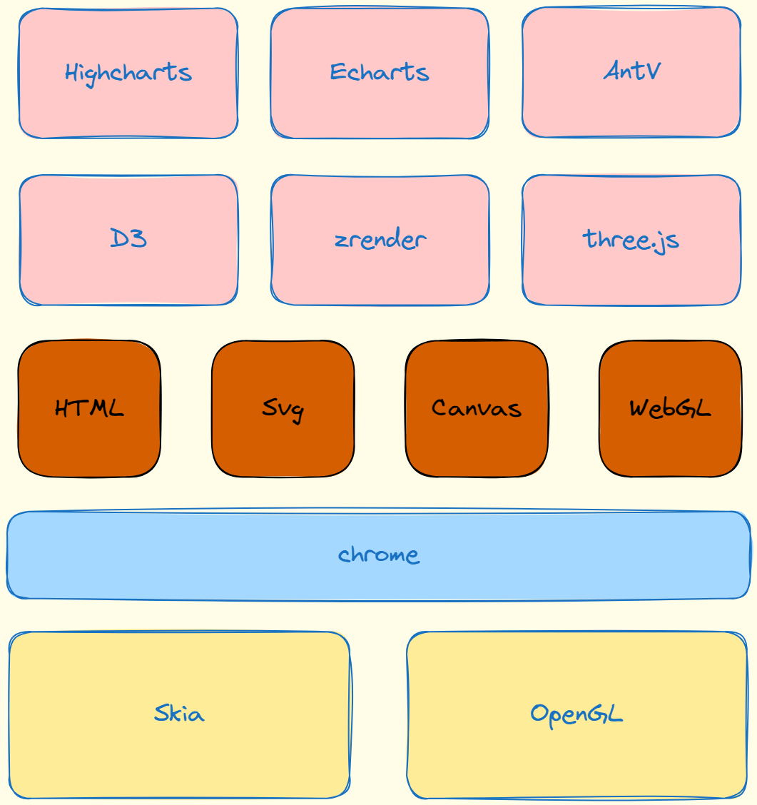
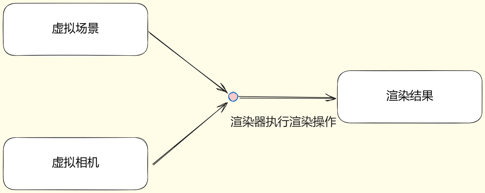

# 一站式前端可视化解决方案
常见的前端可视化解决方案包括：Canvas、 D3、 threeJs、 antV、 Echarts等。

本文是一个提纲，具体每个部分的内容将以内链的方式逐渐补充，欢迎关注，后续精彩内容马上到来！

## 基本概念
### 1. 数据可视化
数据可视化的定义为：把数据经过一定的转换之后变成图形显示的操作过程。

### 2. 数据类型
数据可以分成**定量**和**定性**数据两个大类。

其中，定量数据又可以分成：**连续或者离散型数据**；而定性数据又可以分成**文本描述数据**和**有序/无序数据**

### 3. 数据转成图形的步骤
- 执行映射将数据和不同的标度对应起来
- 选择合适的图形将这种构建的映射关系体现出来（颜色、一维、二维、三维图形、悬浮提示等）

### 4. 坐标轴
**构建坐标轴是数据可视化的第一步！**
- 直角坐标系：可分成线性和非线性；x轴向右，y轴向下
- 极坐标系
- 三维直角坐标系：右手定则

### 5. 颜色标度
颜色标度的作用：**颜色是可视化当中重要的一个数据展示标度**
- 给数据分组
- 不同颜色对应数据
- 指定数据突出显示

### 6. 可视化解决方案
基于上述基本概念，前端可视化解决方案可以**分层**，**分级**，如下所示:

可能大家会对Skia不是很熟，其实Skia是chrome和安卓端的二维绘制引擎。

而OpenGL则是二维和三维图形渲染库。

## canvas部分

### 1. canvas绘制直线

### 2. canvas适配分辨率

### 3. canvas绘制坐标系

### 4. canvas绘制直方图

### 5. canvas绘制圆形

### 6. canvas绘制文字

### 7. canvas中的碰撞检测

### 8. canvas封装动画

### 9. canvas绘制关系图

### 10. 封装一个自己的canvas库 -- 工程化

### 11. 封装一个自己的canvas库 -- 初始化

### 12. 封装一个自己的canvas库 -- 动画函数

### 13. 封装一个自己的canvas库 -- 进度圆环
#### 初始化
#### 绘制

### 14. 封装一个自己的canvas库 -- 折线图
#### 坐标轴
#### 展示数据
#### 数据连线
#### 绘制刻度

### 15. 封装一个自己的canvas库 -- 直方图

### 16. svg绘制基本图形
#### 像素图和矢量图
- 像素图
- 矢量图

### 17. D3基本使用方式
#### D3操作svg
#### D3绑定数据
#### D3的三种选择集

### 18. D3绘制直方图
#### 使用线性比例尺
#### D3常见比例尺
#### 比例尺和坐标轴

### 19. D3过渡动画

### 20. D3绘制动态直方图

### 21. D3交互

### 22. web GL和Three.js
#### 浏览器端的3D呈现技术
#### js操作显卡的技术
#### three.js

### 23. three.js中的基本元素：场景、相机、渲染、几何体
它们之间的关系可以表示成：

#### 场景：可以理解成为展示的舞台

#### 内容：浏览器中呈现的内容都可以看成是相机拍摄的

#### 相机：正投影相机和透视相机
- 正投影相机：远近处的内容做同等大小呈现处理
- 透视相机： 近大远小，灭点消失：`THREE.PerspectiveCamera = function(fov, aspect, near, far){}`

#### 渲染器：决定了内容如何呈现至屏幕

### 24. ThreeJS绘制立方体

### 25. 材质与相机控制

### 26. 场景添加光源

### 27. 精灵材质与交互操作

### 28. VR全景几何体实现

### 29. 添加全景中的地标

### 30. 全景看房实现