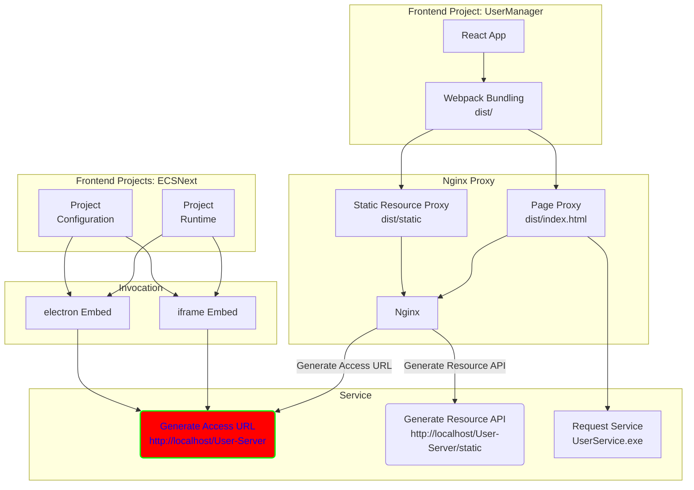

最近笔者负责的一个前端项目部署上线了，现将其分享出来，供各位大佬指点。

## 项目背景
前端项目需要集成兄弟部门开发的一个服务UserService，此服务在改造之前只能用在client端，即在node环境下通过shell指令打开，本质上是新的进程，使用electron开发。现需要对其改造，使其能支持web和client端。

## 部署思路
改造思路为：前端项目首先打包生成dist目录；然后使用nginx分别代理入口文件dist/index.html和静态资源路径dist/static/;最后直接将nginx代理的url作为使用iframe或者electron的入口。

在次改造过程中，提供api接口服务的后端程序会随着调用方一起启动，并且在前端项目中直接使用正确的接口地址而无需使用nginx做代理。
## 架构拓扑
使用mermaid标识此次部署的结构：
