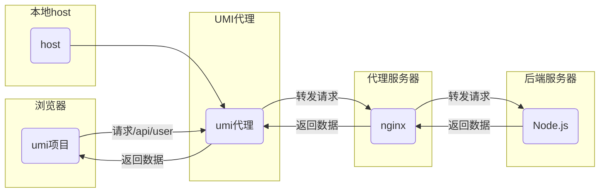

本文主要叙述umi项目中如何配置代理；具体来说就是.umirc.ts中的proxy字段内容的配置。
## 0. 测试用项目结构的搭建
使用umi脚手架快速搭建项目结构
```bash
npx create-umi
```
## 1. 配置proxy字段
在.umirc.ts文件中配置一个代理，如下所示：
```ts
import { defineConfig } from "umi";

export default defineConfig({
  routes: [
    { path: "/", component: "index" },
    { path: "/docs", component: "docs" },
  ],
  npmClient: 'yarn',
  proxy:{
    '/api': {
      target: 'http://my-test',
      changeOrigin: true,
    },
  }
});
```

此代理的含义为：项目中所有以`/api`开头的请求都会被转发到`http://my-test`

可以看出来，proxy字段的值本质上是一个对象，其格式为：`Record<string, Record<'target':string>>`

## 2. 配置host文件
找到`C:\Windows\System32\drivers\etc\hosts`文件，然后在这个文件中新增一行内容
```plaintext
	127.0.0.1            my-test
```

改动之后记得要以管理员身份保存。

## 3. 配置nginx
找到nginx的配置文件`./conf/nginx.conf`，在其中增加一个server:
```nginx
    server {
        listen 80;
        server_name my-test;

        location /api/user {
            proxy_pass http://127.0.0.1:3000/api/user;
            proxy_set_header Host $host;
        }

    }
```

## 4. 构建后端服务
使用node的http模块搭建一个测试用的后端服务，监视3000端口，当请求为/api/user的时候，返回字符串"hello":
```js
// touch serve.js
const http = require('http');

const server = http.createServer((req, res) => {
  // 设置响应头
  res.setHeader('Content-Type', 'application/json');

  // 根据请求路径进行判断
  if (req.url === '/api/user' && req.method === 'GET') {
    // 返回数据为 "hello"
    const data = {
      message: 'hello'
    };

    // 将数据转换为JSON字符串并发送给客户端
    res.end(JSON.stringify(data));
  } else {
    // 如果请求路径不匹配，返回404 Not Found
    res.statusCode = 404;
    res.end();
  }
});

// 监听在端口3000
server.listen(3000, () => {
  console.log('Server is running on port 3000');
});
```

## 5. 测试

### 5.1 增加请求代码
在umi项目的`src\layouts\index.tsx`文件中，增加请求代码：
```tsx
import { extend } from 'umi-request';

const request = extend({});

const re = async () => {
  const data = await request.get(
    '/api/user',
  );
  console.log('data',data);
}
```

### 5.2 启动nginx
找到**nginx.exe**所在的目录，打开cmd终端，执行`nginx.exe`命令.

### 5.3 启动umi项目
在项目根目录下面执行：

`yarn start`

观察console有没有输出打印数据！

## 总结
整个代理的数据流图如下所示：
